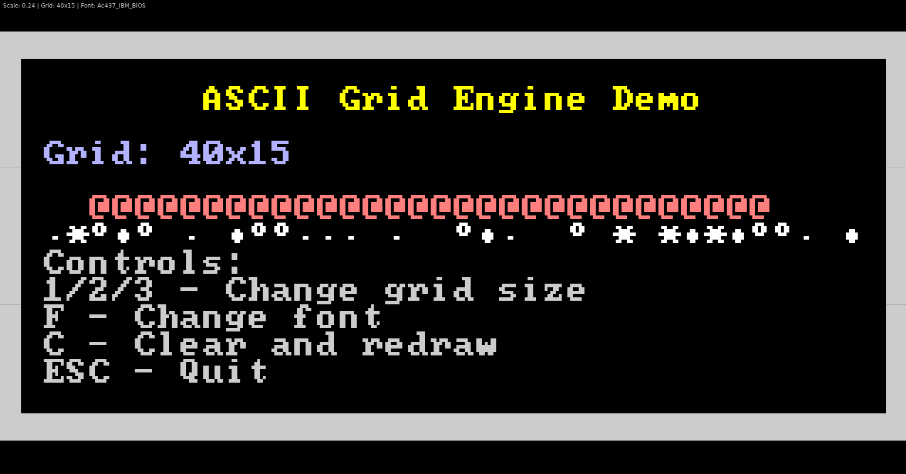

# Love ASCII Grid Engine

A solid foundation for creating ASCII-based games in Love2D. This engine provides a flexible grid-based rendering system with layer support, perfect for roguelikes, text adventures, and retro-style games.



# import into project
You can either load in the folder `src` directly into your love2d project or use this repo as a git submodule

## use as a git submodule
1. `git submodule add https://github.com/Saturn91/loveAsciiGrid.git libs/loveAsciiGrid`
2. in order to allow relative imports use this handy code:

```lua
local packages = {
  "libs/loveAsciiGrid/?.lua",
}

local current = love.filesystem.getRequirePath and love.filesystem.getRequirePath() or "?.lua;"
love.filesystem.setRequirePath(table.concat(packages, ";") .. ";" .. current)
```

### Setting Up the Require Path

To use the submodule in your Love2D project, add the require path setup code to the top of your `main.lua` file (before any `require()` calls that use the submodule):

```lua
-- Set up require path for the LoveAsciiGrid submodule
local packages = {
  "libs/loveAsciiGrid/?.lua",
}

local current = love.filesystem.getRequirePath and love.filesystem.getRequirePath() or "?.lua;"
love.filesystem.setRequirePath(table.concat(packages, ";") .. ";" .. current)

-- Now you can require modules from the submodule
local AsciiEngine = require("asciiEngine.engine")
local AsciiGrid = require("asciiEngine.asciiGrid")
```

This tells Love2D's filesystem to look for modules in the `libs/loveAsciiGrid/` folder. After this setup, you can use the library as shown in the Usage section.

## Features

- **Grid-based ASCII rendering** with automatic scaling and centering
- **Multi-layer system** for organizing different game elements
- **Font support** with easy font switching
- **Sprite support** for graphical elements in grid cells
- **Responsive scaling** that maintains aspect ratio
- **Coordinate conversion** between screen and grid coordinates
- **Modular design** for easy integration into other projects

## Getting Started

### Prerequisites

- [Love2D](https://love2d.org/) (LÖVE) game framework

### Installation

1. Clone this repository:
```bash
git clone https://github.com/yourusername/LoveAsciiGrid.git
cd LoveAsciiGrid
```

2. Run the demo:
```bash
love .
```

## Usage

### Basic Setup

```lua
local packages = {
  "libs/loveAsciiGrid/?.lua",
}

local current = love.filesystem.getRequirePath and love.filesystem.getRequirePath() or "?.lua;"
love.filesystem.setRequirePath(table.concat(packages, ";") .. ";" .. current)

local AsciiEngine = require("asciiEngine.engine")
local AsciiGrid = require("asciiEngine.asciiGrid")

local engine = nil

function love.load()
    -- Create the engine
    engine = AsciiEngine:new({
        gridCols = 80,
        gridRows = 25,
        font = love.graphics.newFont("path/to/font.ttf", 240)
    })
    
    -- Add a grid layer
    engine:addLayer(AsciiGrid:new("main"))

    local mainGrid = engine:getLayerById("main")
    mainGrid:writeText(3, 3, "Hello, ASCII Game!", {1.0, 1.0, 0.0, 1.0})

    -- Calculate initial scaling
    engine:calculateScaling()
end

function love.draw()
    engine:draw()
end

function love.resize()
    engine:resize()
end
```

### Working with Grids

```lua
local grid = engine:getLayerById("main")

-- Set individual characters
grid:setCell(x, y, {
    glyph = "@",
    color = {1.0, 1.0, 1.0, 1.0}
}) -- White @ symbol

-- Write text
grid:writeText(10, 5, "Hello World!", {1, 1, 0, 1}) -- Yellow text

-- Draw borders
grid:drawBorder("█", {0.8, 0.8, 0.8, 1}) -- Gray border

-- Clear the grid
grid:clear()
```

### Using Sprites

Sprites allow you to render graphical elements in grid cells, which can be used alongside or instead of ASCII characters. Sprites automatically scale to fit the grid cell size.

#### 1. Creating a Spritesheet

First, create a spritesheet from an image file. The spritesheet divides the image into a grid of tiles.

```lua
-- Create a spritesheet with default 16x16 tiles
local spriteSheet = SpriteSheet.new("path/to/sprites.png")
```

#### 2. Creating a Sprite

Extract individual sprites from the spritesheet using grid coordinates.

```lua
-- Get a sprite at position (0, 0) top left in the spritesheet grid
local playerSprite = spriteSheet:getSprite({x = 0, y = 0})

```

#### 3. Using Sprites in the Grid

Assign sprites to grid cells. If both a glyph and sprite are set, the sprite takes priority.

```lua
-- Set a sprite in a cell
grid:setCell(x, y, {
    sprite = playerSprite,
    color = {1.0, 1.0, 1.0, 1.0}  -- Optional tint color
})

-- You can also combine with glyph (only the sprite will be drawn)
grid:setCell(x, y, {
    glyph = "@",
    sprite = playerSprite,
    color = {1.0, 0.5, 0.0, 1.0}
})
```

### Multiple Layers

```lua
-- Background layer
local bgGrid = AsciiGrid:new("background")
engine:addLayer(bgGrid)

-- Main game layer
local gameGrid = AsciiGrid:new("game")
engine:addLayer(gameGrid)

-- UI layer
local uiGrid = AsciiGrid:new("ui")
engine:addLayer(uiGrid)
```

## Demo Controls

- **1/2/3** - Switch between different grid sizes (40x15, 80x25, 120x35)
- **F** - Cycle through different fonts
- **C** - Clear and redraw the demo
- **ESC** - Quit

## API Reference

### AsciiEngine

#### Constructor
- `AsciiEngine:new(options)` - Create a new engine instance

#### Methods
- `setFont(font)` - Change the font
- `setGridSize(cols, rows)` - Change grid dimensions
- `addLayer(layer)` - Add a new layer
- `getLayerById(id)` - Retrieve a layer by ID
- `draw()` - Render all layers
- `resize()` - Recalculate scaling after window resize
- `screenToGrid(x, y)` - Convert screen coordinates to grid coordinates
- `gridToScreen(x, y)` - Convert grid coordinates to screen coordinates

### AsciiGrid

#### Constructor
- `AsciiGrid:new(id)` - Create a new grid layer

#### Methods
- `setCell(x, y, options)` - Set content at position. Options can include: `glyph` (string), `color` (table), `backgroundColor` (table), `sprite` (Sprite object)
- `getCell(x, y)` - Get cell data at position
- `writeText(x, y, text, color, backgroundColor)` - Write text starting at position
- `drawBorder(glyph, color)` - Draw a border around the grid
- `clear(glyph, color, backgroundColor)` - Clear all cells with optional defaults

## File Structure

```
LoveAsciiGrid/
├── main.lua                    # Demo application
├── asciiEngine/
│   ├── engine.lua             # Core engine
│   └── asciiGrid.lua          # Grid layer implementation
├── spriteSheet/
│   ├── Sprite.lua             # Sprite class for individual sprites
│   └── SpriteSheet.lua        # Spritesheet management
├── assets/
│   └── fonts/                 # Font files
└── README.md
```

## Integration into Your Project

### Option 1: Copy Module Files
Copy the `asciiEngine/` folder to your project and require the modules:

```lua
local AsciiEngine = require("asciiEngine.engine")
local AsciiGrid = require("asciiEngine.asciiGrid")
```

### Option 2: Git Submodule
Add as a git submodule:

```bash
git submodule add https://github.com/yourusername/LoveAsciiGrid.git lib/AsciiEngine
```

### Option 3: Create Library Entry Point
Create an `init.lua` in the asciiEngine folder for cleaner imports:

```lua
local AsciiEngine = require("asciiEngine")
local engine = AsciiEngine.Engine:new({...})
local grid = AsciiEngine.Grid:new("main")
```

## Example Games

This engine is perfect for creating:

- **Roguelike games** (dungeon crawlers, RPGs)
- **Text adventures** and interactive fiction
- **ASCII art applications**
- **Terminal-style interfaces**
- **Retro puzzle games**
- **Code editors** and development tools

## Contributing

1. Fork the repository
2. Create a feature branch
3. Make your changes
4. Add tests if applicable
5. Submit a pull request

## License

This project is licensed under the MIT License - see the LICENSE file for details.

## Acknowledgments

- Built with [Love2D](https://love2d.org/)
- Inspired by classic ASCII games and roguelikes
- Font support includes IBM BIOS fonts and DejaVu Sans Mono